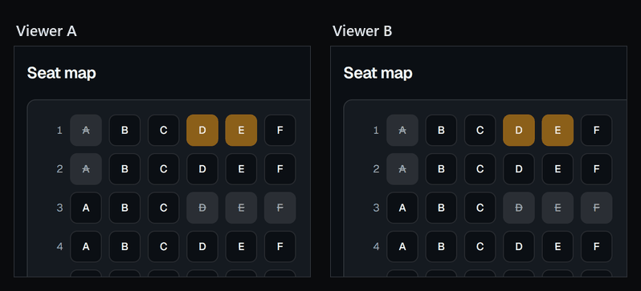
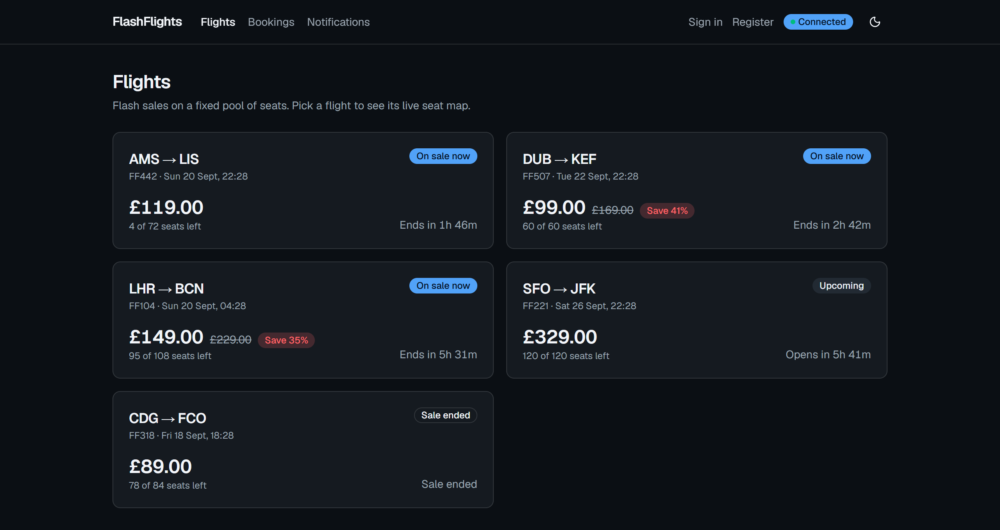
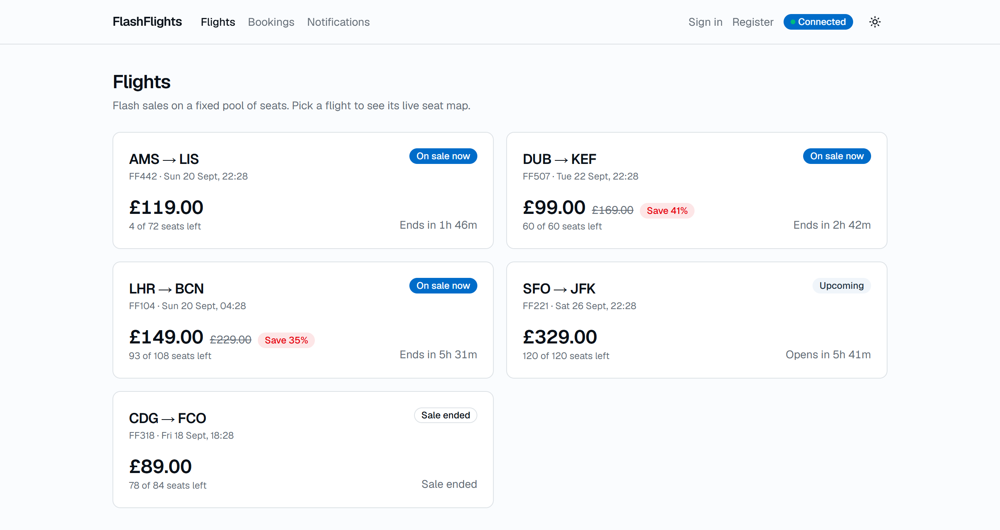
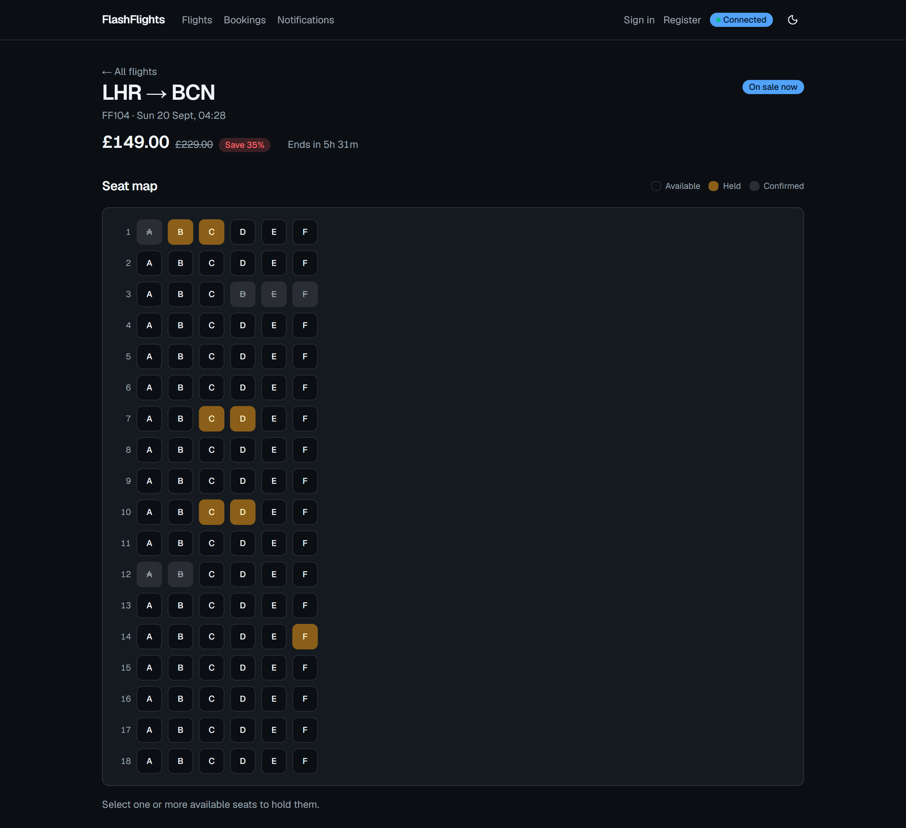
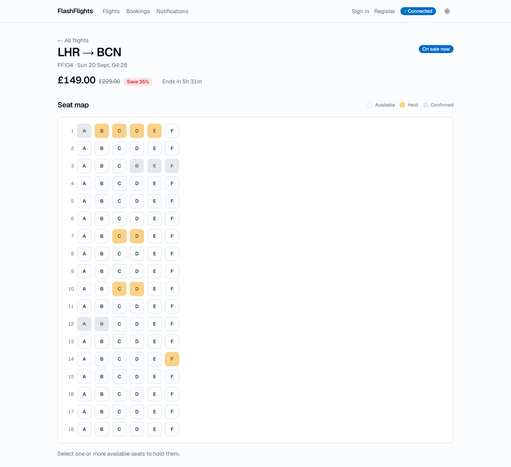
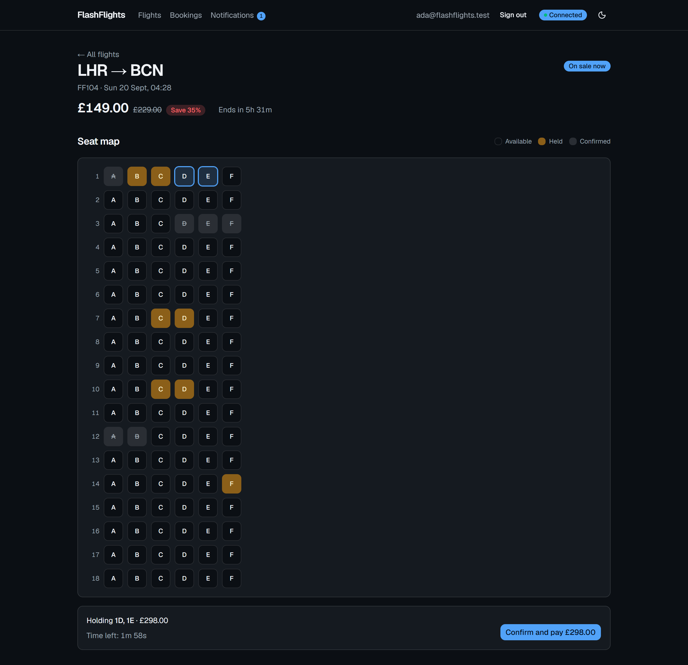
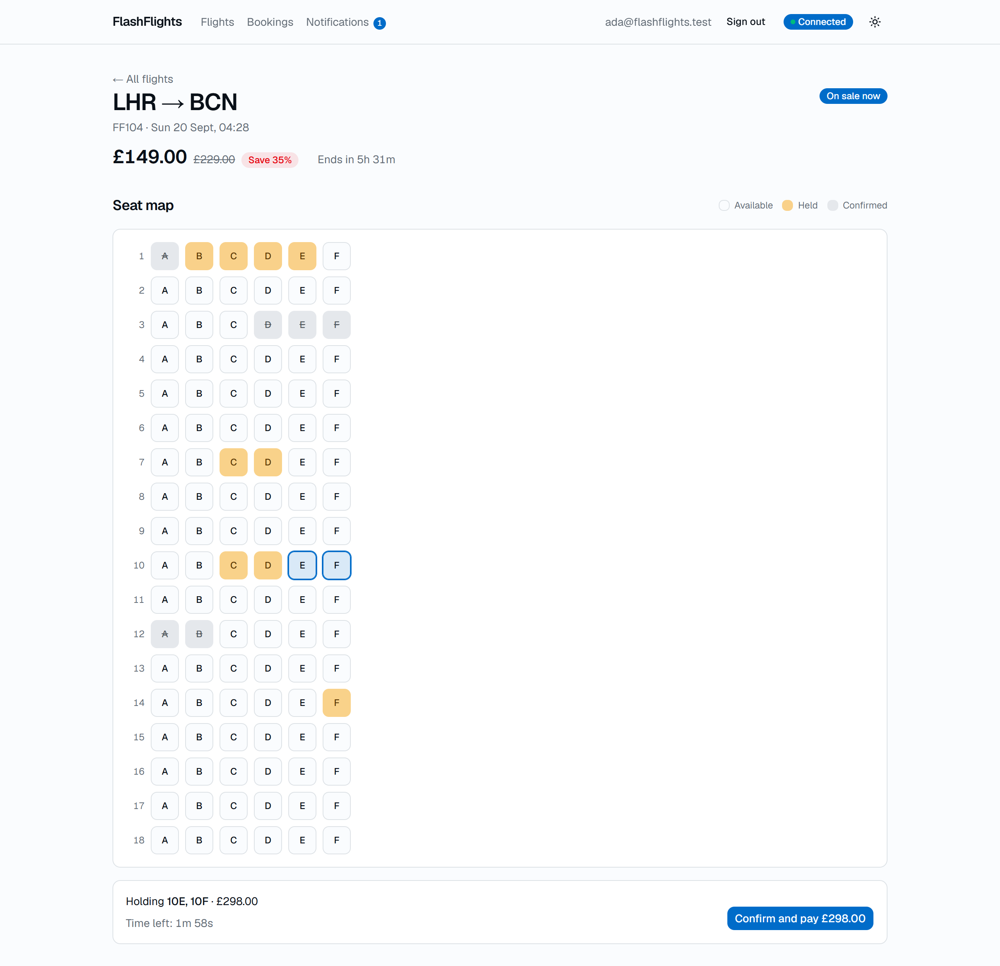
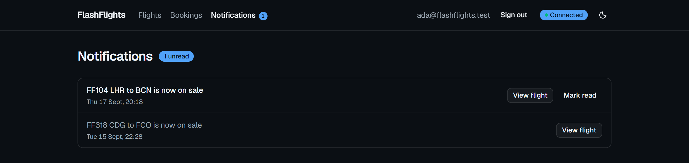
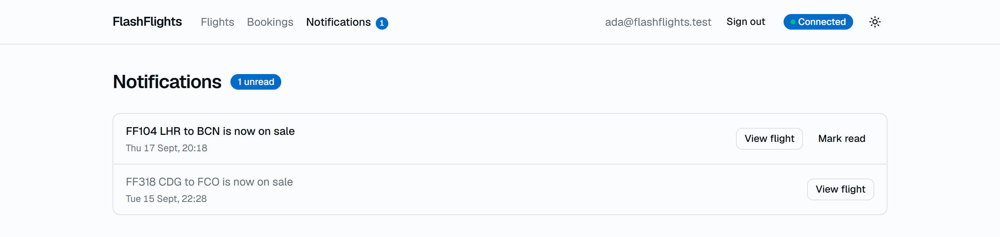

# FlashFlights

[](https://github.com/hzkueh/FlashFlights/actions/workflows/build.yml)

**Two buyers can never both win the same seat — and this repo proves it rather
than claiming it.**

FlashFlights is an airline flash-sale ticketing system built to demonstrate two
things that are hard to fake: **safe concurrent booking across service
boundaries**, and **live real-time delivery** of a fast-changing shared fact to
every connected viewer. Buyers browse flights running time-boxed flash sales,
pick specific seats on a seat map that updates the instant anyone else touches
it, and book before the window closes or the seats run out.

The interesting part is not that it books seats. It is that the no-double-book
guarantee is enforced inside a row-locked transaction over an append-only
ledger, is tested under genuinely parallel load against real PostgreSQL, and
was **demonstrated failing before it was made to pass** — see
[the concurrency proof](#the-concurrency-proof-red-then-green), which is the
single thing in this repo most worth your time.



_Two independent viewers on one flight. A third buyer holds seat 2B and then
confirms it; neither window is refreshed or clicked. Captured from the running
stack — see [how](#how-the-demo-media-was-captured)._

## What this actually demonstrates

- **A concurrency guarantee that is tested, not asserted.** 20 parallel
  `CreateHold` calls are released together at one seat by a `Barrier`; exactly
  one wins and 19 get a clean 409. Against a real containerised PostgreSQL,
  because SQLite would serialise the writers and the race could never occur to
  be caught.
- **Real-time delivery across a service boundary.** Ordering commits seat
  movements and publishes events; Notifications relays them over SignalR to
  every viewer watching that flight. The seat map repaints without a refetch.
- **Services that are actually separate.** Three independently runnable .NET
  services with their own datastores, behind a YARP gateway, talking over
  MassTransit + RabbitMQ — not a monolith wearing a microservices label.
- **Deliberate eventual consistency, stated as such.** The browse counts are a
  projection that is allowed to lag. Ordering never reads it when granting a
  hold.

## Run it

You need Docker. Nothing else.

```bash
git clone https://github.com/hzkueh/FlashFlights.git
```

```bash
cd FlashFlights && docker compose up
```

Then open **<http://localhost:8080>**. The first run builds five images and
takes a few minutes; after that it is seconds.

The stack **seeds itself on first start**, so it comes up populated — five
flights spanning live, upcoming, and already-ended sale windows, cabins with a
realistic mix of available, held, and confirmed seats, and demo buyers who
already have bookings, watches, and an inbox.

### Signing in

Every demo buyer shares the password **`FlashDemo1`**. These credentials are
public on purpose: a reviewer has to be able to sign in as someone with history,
and there is no admin surface that could hand them any.

| Sign in as                   | What they have                                       |
| ---------------------------- | ---------------------------------------------------- |
| `ada@flashflights.test`      | **Start here.** Two bookings, three watches, an inbox with one unread |
| `grace@flashflights.test`    | Two bookings, a live hold, and a watch                |
| `alan@flashflights.test`     | A booking and two live holds                          |
| `katherine@flashflights.test`| A booking, and a watch on the flight whose sale opens ~45s after the seed |

Set `DemoSeed__Enabled=false` to turn the seed off entirely — a password in a
README is right for a laptop and wrong everywhere else.

### Things worth trying

- **Watch a sale open live.** `FF507 DUB→KEF` opens about 45 seconds after the
  stack first starts. Sign in as Katherine within that window and the
  notification arrives pushed, not polled.
- **See the counts and the map disagree, by design.** The list page's "4 of 72
  seats left" is a projection; the seat map reads live from Ordering. See
  [the ledger](#the-seatmovement-ledger).
- **Lose a race on purpose.** Hold a seat in one window, then try the same seat
  in another. You get a 409 naming the seat, never a false success.
- **Let a hold lapse.** Hold seats and walk away. The TTL is ~2 minutes; the
  sweep runs every 15 seconds and releases them back to the pool.

## The concurrency proof: red, then green

This is the point of the project, so it was built in the order that makes it
evidence rather than decoration: **the naive implementation was written and
committed first, watched handing the same seat to twenty buyers at once, and
only then fixed.** A test that has never failed is not proof that a guarantee
holds.

### 1. The naive version

`HoldService.LockSeatsAsync` was a no-op. The grant ran inside a transaction,
but took no row lock:

```csharp
private Task LockSeatsAsync(IReadOnlyList<Guid> seatIds, CancellationToken cancellationToken) =>
    Task.CompletedTask;
```

### 2. Red — twenty buyers, one seat, twenty winners

`CreateHoldConcurrencyTests` fires 20 parallel `CreateHold` calls, each on its
own connection, all released together by a `Barrier`, at a single seat:

```text
[xUnit.net 00:00:17.61]     FlashFlights.Ordering.Tests.CreateHoldConcurrencyTests.Exactly_one_of_many_parallel_holds_on_the_same_seat_wins [FAIL]
  Failed FlashFlights.Ordering.Tests.CreateHoldConcurrencyTests.Exactly_one_of_many_parallel_holds_on_the_same_seat_wins [5 s]
  Error Message:
   Assert.Equal() Failure: Values differ
Expected: 1
Actual:   20

Failed!  - Failed:     1, Passed:     0, Skipped:     0, Total:     1
```

Every contender won. Each opened its transaction, read a seat with no live
movement, and appended `Held`. Under READ COMMITTED the readers never saw one
another. **That is the double-booking this project exists to make impossible.**

### 3. The fix

Lock exactly those seat rows for the life of the transaction:

```sql
SELECT "Id" FROM "Seats" WHERE "Id" = ANY(@seatIds) ORDER BY "Id" FOR UPDATE
```

The second and later contenders block until the first commits, then re-read the
now-current ledger, see the `Held` movement, and lose cleanly with a 409.

### 4. Green — same test, unchanged

```text
  Passed FlashFlights.Ordering.Tests.CreateHoldConcurrencyTests.Exactly_one_of_many_parallel_holds_on_the_same_seat_wins [2 s]

Test Run Successful.
Total tests: 3
     Passed: 3
```

The test asserts more than the API replies: it also counts `Held` movements in
the ledger itself, because a second one there is a double-hold that slipped past
the reply-counting. `ConfirmHold` has its own version of the race — many
parallel confirms of one hold must yield exactly one booking — and is tested the
same way.

The captured red run is kept verbatim in
[`.scratch/flashflights-mvp/artifacts/concurrency-proof-red.md`](.scratch/flashflights-mvp/artifacts/concurrency-proof-red.md).

## Architecture

```text
                       browser (React SPA)
                               |
                      YARP gateway  :8080
              ( + ASP.NET Identity, JWT issuance )
                               |
        +----------------------+----------------------+
        |                      |                      |
    Catalog                Ordering             Notifications
    SQLite                 PostgreSQL              SQLite
    browse, sale           holds, bookings,     watches, inbox,
    windows, counts        SeatMovement ledger   SignalR hubs
        |                      |                      |
        +------------- RabbitMQ (MassTransit) --------+
```

### Who owns what

**`Catalog`** owns flights, seats-as-catalogued, and sale windows. It serves
browsing, runs the scheduler that detects a flight crossing its `SaleStartsAt`,
and keeps an eventually-consistent **projection** of per-flight seat counts. Its
counts are advisory decoration — Ordering never consults them.

**`Ordering`** owns the `SeatMovement` ledger, holds, and bookings. It is the
**sole authority** on whether a seat can be taken. It is the only service on
PostgreSQL, and the only one that needs to be.

**`Notifications`** owns watches and the persisted inbox, and hosts both SignalR
hubs: `/hubs/seat-map` (relaying seat movements to viewers of a flight) and
`/hubs/notifications` (a user's own alerts). It consumes events and takes no
dependency on Catalog or Ordering — it composes what a user reads from the
message alone.

### The gateway, and why auth is not a fourth service

The **YARP gateway** is the single entry point: `/api/catalog/**`,
`/api/ordering/**`, `/api/notifications/**` are proxied, and everything else is
the SPA's own routing. The browser is same-origin with the API, so there is no
CORS dance in the shipped setup.

**Auth is hosted alongside the gateway, not as its own service.** ASP.NET Core
Identity and JWT issuance live there; the three services only *validate* tokens
against a shared signing key. A dedicated identity microservice would have added
a network hop, a fourth datastore, and an availability dependency in front of
every authenticated call — to solve a problem this system does not have. One
symmetric key, one user store, three validators.

### Event contracts

| Event | Published by | Consumed by | Why |
| ----- | ------------ | ----------- | --- |
| `SeatsHeld` / `SeatsReleased` / `SeatsConfirmed` | Ordering | Catalog's projector, Notifications' relay | Keep browse counts fresh; push live seat-map updates |
| `FlightSaleStarted` | Catalog | Notifications | Fire every watch on that flight, once |

One event per committed operation — a whole hold, a whole confirm — never one
per seat. Each carries `OccurredAt` as a high-water mark so a consumer can drop
a redelivery or a late arrival rather than double-count it.

These events are **advisory**. Ordering never reads what anyone does with them
when granting a hold, so an event lost, doubled, or delivered late can only make
the browse counts briefly wrong. It can never let two buyers win the same seat.

## The SeatMovement ledger

A seat's status is never a stored, mutable column. Every change is an
append-only **`SeatMovement`** — `Held`, `Released`, or `Confirmed` — and
`SeatStatus` is *computed* from the latest movement for that seat, inside the
same row-locked transaction that grants a new hold.

Consequences worth knowing before reading the code:

- **A stale cache can never claim a seat is takeable when it isn't**, because
  there is no cache in the decision path.
- **An unresolved hold past its TTL computes back to Available on read**,
  without the sweep having run. The sweep posts the compensating `Released`
  movement for auditability — and, load-bearingly, so Catalog's counts learn of
  the expiry at all.
- **The counts and the seat map can disagree about the same flight.** The map
  reads live from Ordering and self-heals; the counts only learn from the swept
  `Released` event. The sweep interval (15s) is what bounds that window, not
  audit latency.
- **Ordering runs on PostgreSQL because SQLite cannot express this.** SQLite
  serialises every writer behind one database-level lock: it would appear to
  uphold the guarantee while proving nothing, because the race could never
  happen. Catalog and Notifications carry no such constraint and use SQLite.

Full reasoning: **[ADR-0001 — Seat status is derived from an append-only,
per-seat SeatMovement ledger](docs/adr/0001-seat-movement-ledger.md)**.

Three more decisions are recorded in [`docs/adr/`](docs/adr/): how
[Notifications learns a sale opened](docs/adr/0002-notifications-learns-sale-open-from-the-announcement.md),
why [Ordering refuses a hold it has no sale window for](docs/adr/0003-ordering-refuses-a-hold-it-has-no-sale-window-for.md),
and how [one demo world is seeded by each service into its own store](docs/adr/0004-one-demo-world-seeded-by-each-service-into-its-own-store.md).

## Screens

Both themes ship deliberately; neither is an afterthought.

| | Dark | Light |
| --- | --- | --- |
| **Catalog** — live, upcoming and ended sales, seat counts, flash savings |  |  |
| **Seat map** — every seat's computed status, live |  |  |
| **Checkout** — selected seats, hold countdown, confirm |  |  |
| **Inbox** — persisted alerts, delivered live when connected |  |  |

Motion is used in three places and no more: a seat beats when its status moves,
the list settles a card at a time, and a countdown breathes once it turns
critical. All of it is silenced by `prefers-reduced-motion` — while colour and
ring changes survive, because a reader who asked for less movement still has to
see which seat went.

## Running outside compose

Useful when you want a debugger on one service, or hot reload on the SPA.

**1. Infrastructure only** — RabbitMQ and PostgreSQL still come from compose:

```bash
docker compose up rabbitmq ordering-db
```

**2. The three services**, each in its own terminal. The ports are what the
gateway's default (non-compose) configuration expects:

```bash
dotnet run --project src/FlashFlights.Catalog --urls http://localhost:8081
```

```bash
dotnet run --project src/FlashFlights.Ordering --urls http://localhost:8082
```

```bash
dotnet run --project src/FlashFlights.Notifications --urls http://localhost:8083
```

**3. The SPA**, which the gateway fronts at `:5173` in this configuration:

```bash
cd web && npm install && npm run dev
```

**4. The gateway**, which also hosts Identity:

```bash
dotnet run --project src/FlashFlights.Gateway --urls http://localhost:8080
```

Open <http://localhost:8080> as before. Each service creates and seeds its own
store on startup, so there is no migration step to remember.

### Tests

```bash
dotnet test FlashFlights.slnx
```

```bash
cd web && npm test
```

The Ordering suite starts a throwaway `postgres:17-alpine` via Testcontainers,
so **Docker must be running** — a run that skipped those tests would be green
while proving nothing. CI runs both halves as separate jobs on every pull
request, so a broken SPA test cannot hide the state of the backend suite.

## Troubleshooting

**The gateway fails to bind port 8080 on Windows.** If you see `bind: An attempt
was made to access a socket in a way forbidden by its access permissions`,
Windows has reserved 8080 in a WinNAT excluded range. Check with:

```bash
netsh int ipv4 show excludedportrange protocol=tcp
```

Either free the range from an elevated prompt (`net stop winnat && net start
winnat`), or publish the gateway elsewhere with an untracked
`docker-compose.override.yml`:

```yaml
services:
  gateway:
    ports: !override
      - "9090:8080"
```

**A seat doesn't change live in a second window.** Confirm both windows are on
the same flight, then `docker compose logs -f notifications` while you hold a
seat — the relay should log the movement. If nothing appears, check RabbitMQ is
healthy with `docker compose ps`.

**A frontend change isn't showing.** The `web` container serves a bundle baked
at build time: `docker compose build web`.

## How the demo media was captured

The GIF and every screenshot come from the real stack described above, driven
through Chrome by Playwright. The GIF is two genuine viewers of the same flight,
each screenshotted across one real hold-then-confirm; the two panels in a frame
are captured back to back rather than at the same instant, so treat the pairing
as approximate and the state changes as real. A polished screen recording would
be a fair swap for it.

## Where to read next

| | |
| --- | --- |
| [`CONTEXT.md`](CONTEXT.md) | The domain language — what a Hold, a SeatMovement, a Watch actually mean here, and the words this project deliberately avoids |
| [`docs/adr/`](docs/adr/) | The four decisions worth writing down, with their consequences |
| [`src/FlashFlights.Ordering/Holds/HoldService.cs`](src/FlashFlights.Ordering/Holds/HoldService.cs) | The seam the whole project hangs on |
| [`tests/FlashFlights.Ordering.Tests/CreateHoldConcurrencyTests.cs`](tests/FlashFlights.Ordering.Tests/CreateHoldConcurrencyTests.cs) | The test that makes the claim checkable |

---

FlashFlights is a deliberate companion piece to a straightforward .NET CRUD
backend, built to prove different skills rather than repeat them: distributed
concurrency, real-time delivery, and a full SPA frontend. The append-only ledger
pattern is reused on purpose — here proven under real cross-service concurrency
rather than within a single process.
